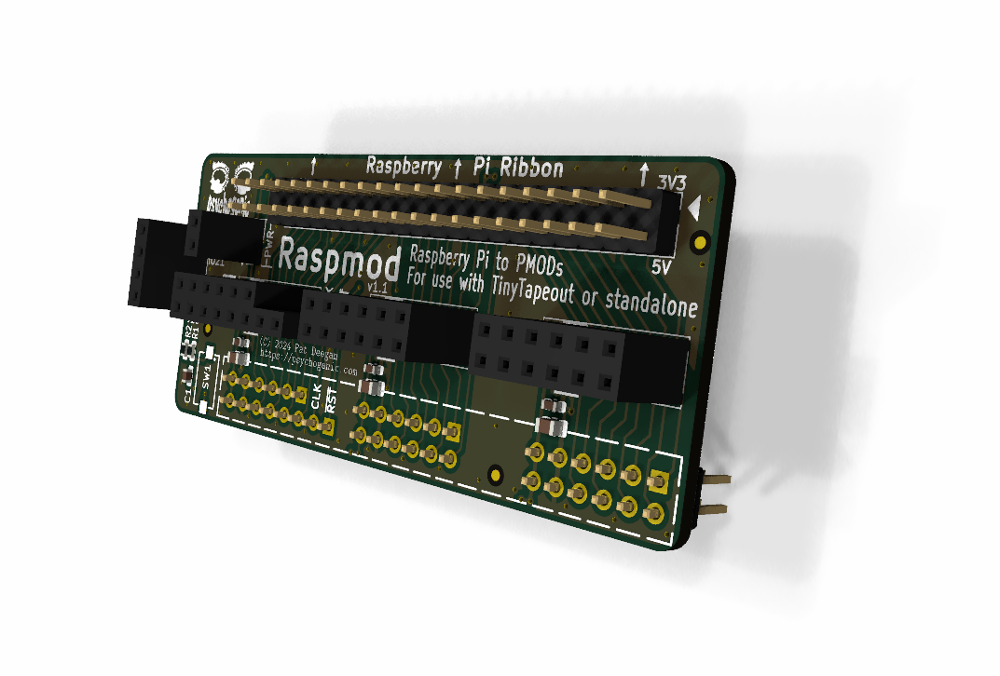
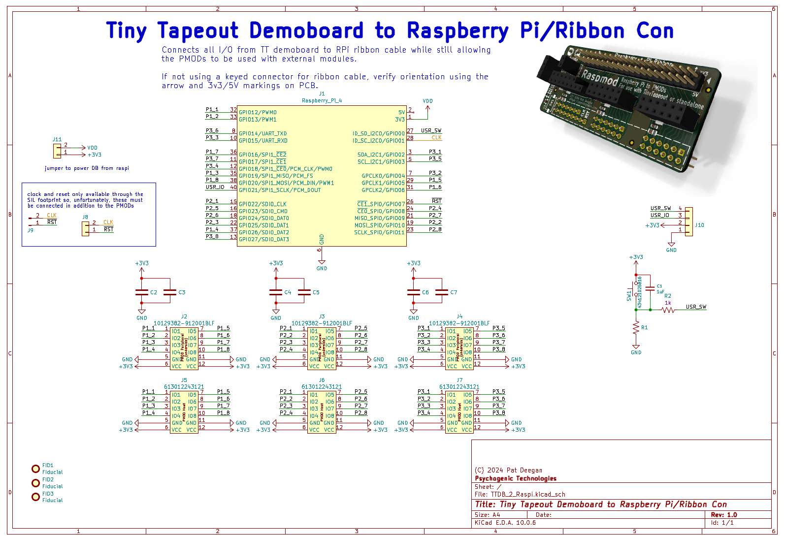

# Raspmod: TinyTapeout demoboard to Raspberry Pi

Connects all I/O from TT demoboard to RPi ribbon cable while still allowing the PMODs to be used with external modules.

Simple two layer board, everything but the 100 mil headers is pretty much optional.

Only annoying bit is that the clock and reset are only available through the SIL (not one of the PMODs) so these must be connected by adding a 2-pin header to the demoboard in the right spot.

 
